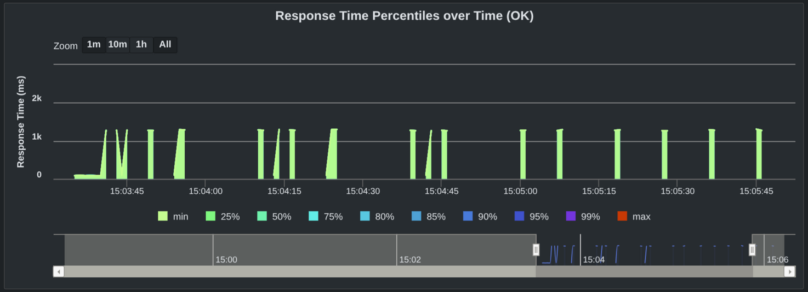

# Tracker performance (2.43)

> **Note:** These are preliminary results based on pre-release builds. Final numbers will be updated when the 2.43.0 release is published.

This document backs the [tracker performance summary](ReleaseNote-2.43.md#tracker) in the 2.43 release notes with the test methodology, raw measurements, and per-issue change list.

## Method

All tests use the [TrackerTest](https://github.com/dhis2/dhis2-core/blob/0bce5b265e8c2d339a8d612b2b880ef2cb271756/dhis-2/dhis-test-performance/src/test/java/org/hisp/dhis/test/tracker/TrackerTest.java) Gatling simulation from `dhis-2/dhis-test-performance`, pinned to master commit [`0bce5b265e8c2d339a8d612b2b880ef2cb271756`](https://github.com/dhis2/dhis2-core/commit/0bce5b265e8c2d339a8d612b2b880ef2cb271756). Runs are executed via the [`performance-tests.yml`](https://github.com/dhis2/dhis2-core/blob/0bce5b265e8c2d339a8d612b2b880ef2cb271756/.github/workflows/performance-tests.yml) workflow. Each run is linked by GitHub Actions run ID; artifacts (Gatling HTML report, `simulation.csv`, ...) are available for 90 days.

p95 values come from [`gstat`](https://github.com/dhis2/gatling-statistics) over each run's `simulation.csv`; see [its percentile note](https://github.com/dhis2/gatling-statistics#percentiles) for why these will not exactly match the Gatling HTML report. All p95 values are in milliseconds. Throughput (req/s) and request counts are computed from `simulation.csv`.

A cell shows `-` when every iteration of that scenario KO'd at the 60s Gatling timeout, leaving no successful samples for a percentile.

All percentage deltas in this document use `(new − old) / old`. In column headers like "2.43 vs 2.42", the first version is `new` and the second is `old` (baseline). Positive throughput deltas mean faster; negative p95 deltas mean faster.

### Versions

| Version | Image | DB_VERSION | Default pool | Notes |
|---|---|---|---|---|
| 2.43.0 | `dhis2/core:2.43.0.0-rc@sha256:f95e0dd187613483972433020ff714ef14d1cc4ddf442d8e0a7f9fe6f63aee55` | 2.42.0 | HikariCP | patch/2.43.0 at [`838e47af4c8`](https://github.com/dhis2/dhis2-core/commit/838e47af4c8) (2026-04-15). |
| 2.42.4 | `dhis2/core:2.42.4` | 2.42.0 | c3p0 | latest stable 2.42 release |
| 2.41.8 | `dhis2/core:2.41.8` | 2.41.0 | c3p0 | latest stable 2.41 release |

### Server

Self-hosted Linux runner: Intel Xeon E3-1275 v6 @ 3.80GHz, 4 cores / 8 threads, 64 GiB RAM. Docker Compose allocates 4 CPUs and 16 GiB each to the `web` (DHIS2) and `db` (PostgreSQL) containers. Both containers run on the same machine.

### DHIS2 configuration

`dhis.conf` is the [default from the performance test module](https://github.com/dhis2/dhis2-core/blob/0bce5b265e8c2d339a8d612b2b880ef2cb271756/dhis-2/dhis-test-performance/docker/dhis.conf):

```properties
connection.dialect = org.hibernate.dialect.PostgreSQLDialect
connection.driver_class = org.postgresql.Driver
connection.url = jdbc:postgresql://db/dhis
connection.username = dhis
connection.password = dhis

system.update_notifications_enabled = off
```

### Warmup

Each run executes the full simulation once as warmup (`WARMUP=1`, the workflow default). Reported numbers are from the measured run only.

### Baseline DB

TrackerTest exercises three programs in the Sierra Leone 2.42.0 dump. All three are sparsely populated, so the import tests run directly on this DB to measure the cost of inserting into a near-empty dataset; the export tests run against a re-seeded DB (see [Export](#export)) so read paths are measured on a larger dataset.

| Program | Type | TEs | Enrollments | Events |
|---|---|---|---|---|
| MNCH / PNC (`uy2gU8kT1jF`) | tracker program | 3 | 3 | 14 |
| Child Programme (`IpHINAT79UW`) | tracker program | 19,030 | 19,031 | 37,643 |
| ANC visit (`lxAQ7Zs9VYR`) | event program | - | - | 3 |

Totals across all programs in the dump: 73,125 tracked entities, 73,133 enrollments, 373,597 events, 1,069,732 attribute values.

### Import payload

Import data is pre-generated [Synthea](https://github.com/synthetichealth/synthea) synthetic patient data:

| Program | Entities per patient (or event) | Breakdown |
|---|---|---|
| MNCH / PNC | 9 | 1 TE + 2 enrollments + 6 events |
| Child Programme | 4 | 1 TE + 1 enrollment + 2 events |
| ANC visit | 1 | 1 event (no TE, no enrollment) |

Each import request posts ~500 entities to `POST /api/tracker?async=false`, so one request imports ~55 MNCH patients, ~125 Child patients, or 500 ANC events. Throughput and p95 differ between programs regardless of version because the per-request work differs.

Programs are imported sequentially (MNCH → Child → ANC).

### How to reproduce

Trigger a single load run via `performance-tests.yml`. The `perf_tests_git_ref` pins the TrackerTest source code; `DHIS2_IMAGE` pins the server under test. Example for 2.43.0:

```sh
gh workflow run performance-tests.yml \
  --repo dhis2/dhis2-core \
  --field perf_tests_git_ref="0bce5b265e8c2d339a8d612b2b880ef2cb271756" \
  --field test_name="import-2.43.0-7users-30min" \
  --field test_env="DHIS2_IMAGE=dhis2/core:2.43.0.0-rc@sha256:f95e0dd187613483972433020ff714ef14d1cc4ddf442d8e0a7f9fe6f63aee55
DB_VERSION=2.42.0
SIMULATION_CLASS=org.hisp.dhis.test.tracker.TrackerTest
MVN_ARGS='-DtestMode=import -DimportUsers=7 -DimportDurationSec=1800'"
```

Substitute `DHIS2_IMAGE`, `DB_VERSION` (see [Versions](#versions)), `importUsers`, and `importDurationSec` for other scenarios.

## Import

Models a bulk-import workload: posts large batches to `POST /api/tracker`. Runs are duration-based: `importUsers` concurrent users loop over import requests for `importDurationSec` seconds per program.

### Concurrency sweep

5-min runs per concurrency level to find each program's throughput plateau. 2.43.0 scales further than 2.42.4 and 2.41.8, which saturate early; beyond ~4 users the older versions only gain p95, no throughput.

**2.43.0** (image `dhis2/core:2.43.0.0-rc@sha256:f95e0dd187613483972433020ff714ef14d1cc4ddf442d8e0a7f9fe6f63aee55`)

Sweet spot: **6 users** (best trade-off across all three programs). All runs had 0 KO.

MNCH / PNC import:

| users | req/s | p95 (ms) | run |
|---|---|---|---|
| 1 | 1.30 | 1214 | [24566167645](https://github.com/dhis2/dhis2-core/actions/runs/24566167645) |
| 2 | 1.97 | 1785 | [24555265579](https://github.com/dhis2/dhis2-core/actions/runs/24555265579) |
| 4 | 2.52 | 3372 | [24555267507](https://github.com/dhis2/dhis2-core/actions/runs/24555267507) |
| 5 | 3.03 | 3274 | [24555269466](https://github.com/dhis2/dhis2-core/actions/runs/24555269466) |
| **6** | **3.78** | **2897** | [24555271744](https://github.com/dhis2/dhis2-core/actions/runs/24555271744) |
| 7 | 3.08 | 4857 | [24555273620](https://github.com/dhis2/dhis2-core/actions/runs/24555273620) |
| 8 | 3.05 | 5701 | [24555275573](https://github.com/dhis2/dhis2-core/actions/runs/24555275573) |

Child Programme import:

| users | req/s | p95 (ms) | run |
|---|---|---|---|
| 1 | 3.15 | 416 | [24566167645](https://github.com/dhis2/dhis2-core/actions/runs/24566167645) |
| 2 | 5.36 | 567 | [24555265579](https://github.com/dhis2/dhis2-core/actions/runs/24555265579) |
| 4 | 7.15 | 1045 | [24555267507](https://github.com/dhis2/dhis2-core/actions/runs/24555267507) |
| 5 | 8.65 | 1012 | [24555269466](https://github.com/dhis2/dhis2-core/actions/runs/24555269466) |
| 6 | 10.48 | 868 | [24555271744](https://github.com/dhis2/dhis2-core/actions/runs/24555271744) |
| **7** | **10.80** | **1126** | [24555273620](https://github.com/dhis2/dhis2-core/actions/runs/24555273620) |
| 8 | 10.31 | 1542 | [24555275573](https://github.com/dhis2/dhis2-core/actions/runs/24555275573) |

ANC visit import:

| users | req/s | p95 (ms) | run |
|---|---|---|---|
| 1 | 3.36 | 604 | [24566167645](https://github.com/dhis2/dhis2-core/actions/runs/24566167645) |
| 2 | 5.50 | 770 | [24555265579](https://github.com/dhis2/dhis2-core/actions/runs/24555265579) |
| 4 | 6.88 | 1422 | [24555267507](https://github.com/dhis2/dhis2-core/actions/runs/24555267507) |
| 5 | 9.11 | 1171 | [24555269466](https://github.com/dhis2/dhis2-core/actions/runs/24555269466) |
| **6** | **9.97** | **1326** | [24555271744](https://github.com/dhis2/dhis2-core/actions/runs/24555271744) |
| 7 | 9.15 | 2295 | [24555273620](https://github.com/dhis2/dhis2-core/actions/runs/24555273620) |
| 8 | 9.17 | 2296 | [24555275573](https://github.com/dhis2/dhis2-core/actions/runs/24555275573) |

**2.42.4** (image `dhis2/core:2.42.4`)

Highest concurrency measured: **4 users**. Throughput is still climbing mildly 1→2→4, but p95 is already several seconds so we stopped there. All runs 0 KO.

MNCH / PNC import:

| users | req/s | p95 (ms) | run |
|---|---|---|---|
| 1 | 0.37 | 3536 | [24566169785](https://github.com/dhis2/dhis2-core/actions/runs/24566169785) |
| 2 | 0.56 | 4472 | [24564635144](https://github.com/dhis2/dhis2-core/actions/runs/24564635144) |
| **4** | **0.76** | **6667** | [24564636860](https://github.com/dhis2/dhis2-core/actions/runs/24564636860) |

Child Programme import:

| users | req/s | p95 (ms) | run |
|---|---|---|---|
| 1 | 0.84 | 1326 | [24566169785](https://github.com/dhis2/dhis2-core/actions/runs/24566169785) |
| 2 | 1.24 | 1742 | [24564635144](https://github.com/dhis2/dhis2-core/actions/runs/24564635144) |
| **4** | **1.71** | **2474** | [24564636860](https://github.com/dhis2/dhis2-core/actions/runs/24564636860) |

ANC visit import:

| users | req/s | p95 (ms) | run |
|---|---|---|---|
| 1 | 1.08 | 1068 | [24566169785](https://github.com/dhis2/dhis2-core/actions/runs/24566169785) |
| 2 | 1.64 | 1652 | [24564635144](https://github.com/dhis2/dhis2-core/actions/runs/24564635144) |
| **4** | **2.13** | **2468** | [24564636860](https://github.com/dhis2/dhis2-core/actions/runs/24564636860) |

**2.41.8** (image `dhis2/core:2.41.8`)

Highest concurrency measured: **4 users**, same shape as 2.42.4. All runs 0 KO.

MNCH / PNC import:

| users | req/s | p95 (ms) | run |
|---|---|---|---|
| 1 | 0.44 | 2699 | [24566171631](https://github.com/dhis2/dhis2-core/actions/runs/24566171631) |
| 2 | 0.62 | 4307 | [24564643009](https://github.com/dhis2/dhis2-core/actions/runs/24564643009) |
| **4** | **0.72** | **7016** | [24564644824](https://github.com/dhis2/dhis2-core/actions/runs/24564644824) |

Child Programme import:

| users | req/s | p95 (ms) | run |
|---|---|---|---|
| 1 | 1.05 | 1096 | [24566171631](https://github.com/dhis2/dhis2-core/actions/runs/24566171631) |
| 2 | 1.61 | 1471 | [24564643009](https://github.com/dhis2/dhis2-core/actions/runs/24564643009) |
| **4** | **2.13** | **2062** | [24564644824](https://github.com/dhis2/dhis2-core/actions/runs/24564644824) |

ANC visit import:

| users | req/s | p95 (ms) | run |
|---|---|---|---|
| 1 | 1.26 | 934 | [24566171631](https://github.com/dhis2/dhis2-core/actions/runs/24566171631) |
| 2 | 2.00 | 1142 | [24564643009](https://github.com/dhis2/dhis2-core/actions/runs/24564643009) |
| **4** | **2.39** | **2104** | [24564644824](https://github.com/dhis2/dhis2-core/actions/runs/24564644824) |

**Summary.**

Throughput at each version's best concurrency (2.43 at 6 users, 2.42.4 and 2.41.8 at 4):

| Program | 2.43.0 req/s | 2.42.4 req/s | 2.41.8 req/s | 2.43 vs 2.42 | 2.43 vs 2.41 |
|---|---|---|---|---|---|
| MNCH | 3.78 | 0.76 | 0.72 | +397% | +425% |
| Child | 10.48 | 1.71 | 2.13 | +513% | +392% |
| ANC | 9.97 | 2.13 | 2.39 | +368% | +317% |

p95 at the same concurrency levels:

| Program | 2.43.0 p95 | 2.42.4 p95 | 2.41.8 p95 | 2.43 vs 2.42 | 2.43 vs 2.41 |
|---|---|---|---|---|---|
| MNCH | 2897 | 6667 | 7016 | -57% | -59% |
| Child | 868 | 2474 | 2062 | -65% | -58% |
| ANC | 1326 | 2468 | 2104 | -46% | -37% |

### Soak test

30 min per program (90 min total per version) at each version's best concurrency (from the [concurrency sweep](#concurrency-sweep)) to verify throughput holds as the DB grows.

**2.43.0** (6 users, 30 min per program, 0 KO): [run 24566213531](https://github.com/dhis2/dhis2-core/actions/runs/24566213531)

| Program | Requests | Entities | req/s | p95 (ms) | vs short-run (300s) p95 |
|---|---|---|---|---|---|
| MNCH | 6,500 | 3,217,500 | 3.60 | 3,605 | +24% |
| Child | 13,895 | 6,947,500 | 7.71 | 1,584 | +83% |
| ANC | 14,602 | 7,301,000 | 8.10 | 1,900 | +43% |

17.5M entities imported across the 90-min run. Throughput drops 5-26% from the short-run peak (MNCH stays close to peak, Child and ANC drop more as their DB grows fastest), p95 rises but stays within a single-digit multiple of the short-run values.

**2.42.4** (4 users, 30 min per program, 0 KO): [run 24599094195](https://github.com/dhis2/dhis2-core/actions/runs/24599094195)

| Program | Requests | Entities | req/s | p95 (ms) | vs short-run (300s) p95 |
|---|---|---|---|---|---|
| MNCH | 1,381 | 683,595 | 0.77 | 6,572 | -1% |
| Child | 2,691 | 1,345,500 | 1.49 | 3,174 | +28% |
| ANC | 3,339 | 1,669,500 | 1.85 | 2,523 | +2% |

3.7M entities in the 90-min run.

**2.41.8** (4 users, 30 min per program, 0 KO): [run 24599094193](https://github.com/dhis2/dhis2-core/actions/runs/24599094193)

| Program | Requests | Entities | req/s | p95 (ms) | vs short-run (300s) p95 |
|---|---|---|---|---|---|
| MNCH | 989 | 489,555 | 0.55 | 10,607 | +51% |
| Child | 3,059 | 1,529,500 | 1.70 | 3,178 | +54% |
| ANC | 3,380 | 1,690,000 | 1.88 | 3,235 | +54% |

3.7M entities in the 90-min run.

**Summary.**

2.43 imports **4.7x more entities** in the same wall time (17.5M vs 3.7M): **4-6x more throughput with 25-66% lower p95**.

| Program | 2.43.0 req/s | 2.42.4 req/s | 2.41.8 req/s | 2.43 vs 2.42 | 2.43 vs 2.41 |
|---|---|---|---|---|---|
| MNCH | 3.60 | 0.77 | 0.55 | +368% | +555% |
| Child | 7.71 | 1.49 | 1.70 | +418% | +354% |
| ANC | 8.10 | 1.85 | 1.88 | +338% | +331% |

| Program | 2.43.0 p95 | 2.42.4 p95 | 2.41.8 p95 | 2.43 vs 2.42 | 2.43 vs 2.41 |
|---|---|---|---|---|---|
| MNCH | 3,605 | 6,572 | 10,607 | -45% | -66% |
| Child | 1,584 | 3,174 | 3,178 | -50% | -50% |
| ANC | 1,900 | 2,523 | 3,235 | -25% | -41% |

### DB connection pool

2.43 defaults to HikariCP; 2.42.4 and 2.41.8 default to c3p0. Either can be overridden with `db.pool.type` in `dhis.conf`. We measured the non-default pool on 2.43 and on 2.42.4. c3p0 is deprecated and will be removed in a future version (see [DHIS2-13818](https://dhis2.atlassian.net/browse/DHIS2-13818)); see the [HikariCP benchmark](https://github.com/brettwooldridge/HikariCP-benchmark) for background on why HikariCP is generally faster.

**2.43: HikariCP (default) vs c3p0.** c3p0 on 2.43 peaks slightly higher in concurrency (7 users vs HikariCP's 6) but delivers up to 11% less throughput and 21-54% higher p95 across all three programs. HikariCP is the recommended default; users who opt into c3p0 get most of the 2.43 improvements but with more tail latency.

| Users | Pool | MNCH req/s | MNCH p95 | Child req/s | Child p95 | ANC req/s | ANC p95 |
|---|---|---|---|---|---|---|---|
| 2 | HikariCP | 1.97 | 1,785 | 5.36 | 567 | 5.50 | 770 |
| 2 | c3p0 | 1.85 | 1,966 | 5.28 | 503 | 5.23 | 832 |
| 4 | HikariCP | 2.52 | 3,372 | 7.15 | 1,045 | 6.88 | 1,422 |
| 4 | c3p0 | 2.35 | 3,830 | 6.92 | 1,107 | 6.17 | 1,681 |
| 6 | HikariCP | 3.78 | 2,897 | 10.48 | 868 | 9.97 | 1,326 |
| 6 | c3p0 | 2.81 | 4,838 | 9.71 | 996 | 8.88 | 1,714 |
| 7 | HikariCP | 3.08 | 4,857 | 10.80 | 1,126 | 9.15 | 2,295 |
| 7 | c3p0 | 3.37 | 4,458 | 10.71 | 1,089 | 10.19 | 1,603 |

At each pool's own sweet spot (HikariCP 6u, c3p0 7u). Δ is (c3p0 − HikariCP) / HikariCP.

| Program | HikariCP req/s | c3p0 req/s | Δ req/s | HikariCP p95 | c3p0 p95 | Δ p95 |
|---|---|---|---|---|---|---|
| MNCH | 3.78 | 3.37 | -11% | 2,897 | 4,458 | +54% |
| Child | 10.48 | 10.71 | +2% | 868 | 1,089 | +25% |
| ANC | 9.97 | 10.19 | +2% | 1,326 | 1,603 | +21% |

c3p0 runs on 2.43: [2u](https://github.com/dhis2/dhis2-core/actions/runs/24620867667), [4u](https://github.com/dhis2/dhis2-core/actions/runs/24620868345), [6u](https://github.com/dhis2/dhis2-core/actions/runs/24620869073), [7u](https://github.com/dhis2/dhis2-core/actions/runs/24620869806).

**2.42.4: c3p0 (default) vs HikariCP.** On 2.42.4 switching to HikariCP is a small win on throughput (3-5% more) and a small shift on p95 (4-5% lower on MNCH and Child, 3% higher on ANC) at matched concurrency (4u, c3p0's sweet spot). It does not close the gap to 2.43: the bulk of the improvement in 2.43 comes from the import path changes listed below, not the pool.

| Users | Pool | MNCH req/s | MNCH p95 | Child req/s | Child p95 | ANC req/s | ANC p95 |
|---|---|---|---|---|---|---|---|
| 2 | c3p0 | 0.56 | 4,472 | 1.24 | 1,742 | 1.64 | 1,652 |
| 2 | hikari | 0.58 | 4,244 | 1.31 | 1,698 | 1.68 | 1,472 |
| 4 | c3p0 | 0.76 | 6,667 | 1.71 | 2,474 | 2.13 | 2,468 |
| 4 | hikari | 0.78 | 6,370 | 1.80 | 2,347 | 2.22 | 2,549 |
| 6 | hikari | 0.88 | 9,138 | 1.92 | 3,499 | 2.33 | 3,483 |

At c3p0's sweet spot (4u), matched concurrency. Δ is (hikari − c3p0) / c3p0.

| Program | c3p0 req/s | hikari req/s | Δ req/s | c3p0 p95 | hikari p95 | Δ p95 |
|---|---|---|---|---|---|---|
| MNCH | 0.76 | 0.78 | +3% | 6,667 | 6,370 | -4% |
| Child | 1.71 | 1.80 | +5% | 2,474 | 2,347 | -5% |
| ANC | 2.13 | 2.22 | +4% | 2,468 | 2,549 | +3% |

hikari runs on 2.42.4: [2u](https://github.com/dhis2/dhis2-core/actions/runs/24601217263), [4u](https://github.com/dhis2/dhis2-core/actions/runs/24601218072), [6u](https://github.com/dhis2/dhis2-core/actions/runs/24601218816).

### What changed

Key import optimizations in 2.43. Most are backported to 2.42/2.41 (shipping in 2.42.5 / 2.41.9); HikariCP as default is **not** backported. Check each Jira for exact backport status.

| Issue | Description |
|---|---|
| [DHIS2-21271](https://dhis2.atlassian.net/browse/DHIS2-21271) | Skip audit JMS pipeline when no consumer exists |
| [DHIS2-21239](https://dhis2.atlassian.net/browse/DHIS2-21239) | Batch changelog inserts via multi-row INSERT |
| [DHIS2-21248](https://dhis2.atlassian.net/browse/DHIS2-21248) | Reduce JSONB serialization overhead for event data values |
| [DHIS2-21234](https://dhis2.atlassian.net/browse/DHIS2-21234) | Validate option sets using preheated data instead of DB queries |
| [DHIS2-21177](https://dhis2.atlassian.net/browse/DHIS2-21177) | Batch-fetch user group members before notification dispatch |
| [DHIS2-21287](https://dhis2.atlassian.net/browse/DHIS2-21287) | Replace linear scans with indexed lookups in validation |
| [DHIS2-21178](https://dhis2.atlassian.net/browse/DHIS2-21178) | Reduce allocations for program rules evaluation |
| [DHIS2-21245](https://dhis2.atlassian.net/browse/DHIS2-21245) | Analyze rules before running to limit context |
| | HikariCP default connection pool (replaces c3p0) |

## Export

Models the read traffic a Capture app user generates while navigating the UI. The request mix is derived from the actual HTTP calls the app issues for common flows (opening event lists, searching TEs, opening a TE, viewing enrollments and events). Each version first runs a deterministic seed (1 user, 50 entities per request, 1000 requests per program = 50k per program, 150k total) to bring all three versions to the same DB state. Both export subsections below run against that same seeded DB.

> DB size after seeding is modest compared to production. Treat absolute numbers as indicative; relative differences between versions on the same DB are fair to compare.

### 1-user export (same-seeded DB)

`smoke` profile: single user, each request repeated 100 times sequentially. Isolates per-request cost without concurrency. All runs 0 KO. Runs: [2.43.0](https://github.com/dhis2/dhis2-core/actions/runs/24599249365), [2.42.4](https://github.com/dhis2/dhis2-core/actions/runs/24599249376), [2.41.8](https://github.com/dhis2/dhis2-core/actions/runs/24599249364).

### Event program (ANC visit) queries

| Request | 2.43.0 p95 | 2.42.4 p95 | 2.41.8 p95 | 2.43 vs 2.42 | 2.43 vs 2.41 |
|---|---|---|---|---|---|
| Go to first page | 156 | 16,858 | 1,980 | **-99.1%** | **-92.1%** |
| Go to second page | 158 | 16,897 | 1,974 | **-99.1%** | **-92.0%** |
| Search not assigned | 150 | 17,263 | 1,979 | **-99.1%** | **-92.4%** |
| Search by date range | 703 | 2,080 | 280 | -66.2% | +151% |
| Get first event | 40 | 47 | 14 | -15% | +186% |
| Get relationships for first event | 4 | 4 | 3 | 0% | +33% |

The three event listing queries (`Go to first page`, `Go to second page`, `Search not assigned`) on 2.43 are ~100x faster than 2.42.4 and ~12x faster than 2.41.8. `Search by date range` is also faster on 2.43 than 2.42.4 (~3x) but slower than 2.41.8 (703 vs 280 ms). `Get first event` is 40 ms on 2.43 vs 47 on 2.42.4 and 14 on 2.41.8 (+26 ms vs 2.41.8); `Get relationships for first event` is within 1 ms on all three. Relevant 2.43 changes on the single event path include the default order change ([DHIS2-20991](https://dhis2.atlassian.net/browse/DHIS2-20991)) and the single-event query join eliminations ([DHIS2-20891](https://dhis2.atlassian.net/browse/DHIS2-20891)). These were unlocked by [DHIS2-17961](https://dhis2.atlassian.net/browse/DHIS2-17961), which split tracker events and single events into separate tables so each path can be optimized independently.

The seeded data does not include any relationships, so relationship lookup times reflect the cost of an empty-result query path only.

### Tracker program (Child Programme) queries

| Request | 2.43.0 p95 | 2.42.4 p95 | 2.41.8 p95 | 2.43 vs 2.42 | 2.43 vs 2.41 |
|---|---|---|---|---|---|
| Get first page of TEs | 106 | 225 | 65 | -53% | +63% |
| Get TEs with enrollment status | 137 | 331 | 174 | -59% | -21% |
| Get TEs from events | 8 | 42 | 9 | -81% | -11% |
| Search TE by name (like) | 125 | 183 | 134 | -32% | -7% |
| Search TE by name (eq) | 26 | 39 | 26 | -33% | 0% |
| Search Birth events | 1,296 | 117 | 87 | +1008% | +1390% |
| Not found TE by name (like) | 109 | 115 | 124 | -5% | -12% |
| Not found TE by name (eq) | 6 | 10 | 15 | -40% | -60% |
| Get first tracked entity | 27 | 41 | 23 | -34% | +17% |
| Get first enrollment | 20 | 21 | 12 | -5% | +67% |
| Get first event from enrollment | 24 | 47 | 13 | -49% | +85% |
| Get relationships for first TE | 4 | 5 | 3 | -20% | +33% |

Tracker queries on 2.43 are consistently faster than 2.42.4. Tracker-event query join eliminations ([DHIS2-20922](https://dhis2.atlassian.net/browse/DHIS2-20922)) contribute on this path, also unlocked by the tracker/single event table split in [DHIS2-17961](https://dhis2.atlassian.net/browse/DHIS2-17961). Against 2.41 the picture is mixed: 5 queries are faster on 2.43, 1 is tied, and 6 are slower by 1-41 ms (only `Get first page of TEs` exceeds 15 ms). We have not characterised run-to-run variance on this pipeline, so small deltas should not be read as regressions without repeated runs.

**`Search Birth events` bimodal regression (observed 2026-04-16, no longer reproducing as of 2026-04-22).** On the original smoke runs `Search Birth events` (tracker-event listing filtered by program stage) was ~15x slower on 2.43 than on 2.41.8 (1,296 ms vs 87 ms at 1 user). Four repeat runs on that date all produced p95 within a ~15 ms band and the same bimodal pattern within each run: the first ~10 requests returned in ~90 ms, then the scenario flipped to a sustained ~1,200 ms mode for the remainder of the run (chart below). Investigation of SQL (captured PG queries and Hibernate logs), DB connection pool stats (HikariCP metrics), and GC pauses from that date showed no correlated regression — the server saw no slow queries, the pool had no waiters, and GC pauses were short and uncorrelated. The slow mode did not reproduce locally on the same 2.43 image and an equivalently-seeded DB (p95 ~60 ms across 100 iterations), so the behavior was specific to the self-hosted CI runner. Five reruns on 2026-04-22 of the same commit, image digest, and DB version no longer reproduce the bimodal (p95 13-34 ms). Something in the runner environment changed; whatever triggered the flip is not currently active. Keeping the original numbers and chart below because the regression did happen, even though we cannot currently reproduce it to dig further.



Each spike in the chart is one of the 100 `Search Birth events` requests. Response times are strictly bimodal: requests are either ~90 ms or ~1,200 ms, with nothing in between. After the first ~10 fast requests, the scenario transitions into the sustained slow mode.

### Multi-user export (same-seeded DB)

`load` profile: N concurrent users loop through the scenario for 300s per run. 2.43 was run at 2/4/6 users; 2.42.4 and 2.41.8 only at 2/4 because they already show failures at 4. 2.43 is the only version that stays at 0 KO across all concurrency levels measured; at 4 users 2.43 is faster than 2.41.8 on every request (including two that did not execute at all on 2.41.8) and faster than 2.42.4 on most. `KO` counts Gatling-level failures (request hit the 60s timeout or a `.check()` assertion on the response failed).

**2.43.0** runs: [2u](https://github.com/dhis2/dhis2-core/actions/runs/24650125776), [4u](https://github.com/dhis2/dhis2-core/actions/runs/24650127007), [6u](https://github.com/dhis2/dhis2-core/actions/runs/24650128223). All 0 KO.

| Request | 2u p95 | 4u p95 | 6u p95 |
|---|---|---|---|
| Go to first page | 12 | 19 | 16 |
| Go to second page | 35 | 40 | 39 |
| Search not assigned | 28 | 38 | 38 |
| Search by date range | 38 | 39 | 39 |
| Get first event | 56 | 91 | 73 |
| Get relationships for first event | 4 | 4 | 5 |
| Get first page of TEs | 59 | 73 | 135 |
| Get TEs with enrollment status | 941 | 948 | 5,122 |
| Get TEs from events | 16 | 11 | 61 |
| Search TE by name (like) | 848 | 894 | 1,037 |
| Search TE by name (eq) | 49 | 54 | 79 |
| Search Birth events | 2,512 | 1,008 | 14,245 |
| Not found TE by name (like) | 748 | 752 | 1,157 |
| Not found TE by name (eq) | 20 | 21 | 24 |
| Get first tracked entity | 67 | 89 | 159 |
| Get first enrollment | 30 | 27 | 177 |
| Get first event from enrollment | 123 | 84 | 350 |
| Get relationships for first TE | 6 | 6 | 27 |

**2.42.4** runs: [2u](https://github.com/dhis2/dhis2-core/actions/runs/24650129500), [4u](https://github.com/dhis2/dhis2-core/actions/runs/24650130673). 10 KOs at 2u (all on ANC listings); 13 KOs at 4u (10 on MNCH import 60s timeouts, 3 on ANC listings).

| Request | 2u p95 | 4u p95 |
|---|---|---|
| Go to first page | - | 59,796 |
| Go to second page | - | 59,879 |
| Search not assigned | - | 59,929 |
| Search by date range | 8,605 | 7,503 |
| Get first event | 44 | 62 |
| Get relationships for first event | 8 | 7 |
| Get first page of TEs | 322 | 372 |
| Get TEs with enrollment status | 781 | 858 |
| Get TEs from events | 57 | 116 |
| Search TE by name (like) | 719 | 975 |
| Search TE by name (eq) | 109 | 91 |
| Search Birth events | 2,460 | 5,874 |
| Not found TE by name (like) | 466 | 491 |
| Not found TE by name (eq) | 34 | 29 |
| Get first tracked entity | 80 | 76 |
| Get first enrollment | 23 | 29 |
| Get first event from enrollment | 79 | 76 |
| Get relationships for first TE | 5 | 6 |

`-` = no successful samples (all iterations KO'd at the 60s Gatling timeout). Of the 10 KOs at 2u, all fall in the three ANC listing requests above.

**2.41.8** runs: [2u](https://github.com/dhis2/dhis2-core/actions/runs/24650132188), [4u](https://github.com/dhis2/dhis2-core/actions/runs/24650133459). 24 KOs at 4u (all on ANC listings). At 4u the ANC scenario `Get first event` and `Get relationships for first event` never execute because the scenario picks the event UID from the `Search by date range` response (`saveAs("eventUid")`) and then runs those two inside a `doIf(session.contains("eventUid"))`; `Search by date range` KOs on all 4 iterations at 2.41.8 4u, so no UID is ever saved and the `doIf` block is skipped.

| Request | 2u p95 | 4u p95 |
|---|---|---|
| Go to first page | 39,952 | - |
| Go to second page | 39,641 | - |
| Search not assigned | 39,735 | - |
| Search by date range | 4,987 | - |
| Get first event | 19 | - |
| Get relationships for first event | 6 | - |
| Get first page of TEs | 106 | 2,676 |
| Get TEs with enrollment status | 117 | 2,644 |
| Get TEs from events | 13 | 299 |
| Search TE by name (like) | 93 | 2,539 |
| Search TE by name (eq) | 57 | 925 |
| Search Birth events | 492 | 27,333 |
| Not found TE by name (like) | 446 | 28,990 |
| Not found TE by name (eq) | 24 | 464 |
| Get first tracked entity | 45 | 196 |
| Get first enrollment | 12 | 65 |
| Get first event from enrollment | 38 | 155 |
| Get relationships for first TE | 4 | 65 |

`-` at 4u: all four ANC listing requests KO'd on every iteration with no successful samples; `Get first event` and `Get relationships for first event` are skipped by the `doIf` gate explained above.

**Summary.**

At 2u the four ANC event program requests on 2.43 are tens of ms while 2.42.4 and 2.41.8 are tens of seconds (or KO'd entirely on 2.42.4); outside of those, 2.43 is slower by ≥ 15 ms vs at least one older version on several tracker program requests (notably `Get TEs with enrollment status`, `Search TE by name (like)`, `Not found TE by name (like)`, `Search Birth events`, `Get first event from enrollment`). At 4u 2.43 is faster than 2.41.8 on every request that executed; the ANC scenario `Get first event` and `Get relationships for first event` never execute on 2.41.8 4u because the scenario gates them on a `saveAs` from `Search by date range`, which KOs on every iteration there (see the 2.41.8 table note). 2.43 is faster than 2.42.4 on most 4u requests but slower on five: `Get first event` (+29 ms), `Get TEs with enrollment status` (+90 ms), `Not found TE by name (like)` (+261 ms), `Get first tracked entity` (+13 ms), `Get first event from enrollment` (+8 ms). The 2.42/2.41 ANC failures under concurrency are not root-caused here; candidates include the single-event query paths that 2.43 addresses via [DHIS2-20991](https://dhis2.atlassian.net/browse/DHIS2-20991) and [DHIS2-20891](https://dhis2.atlassian.net/browse/DHIS2-20891), or connection pool exhaustion.

Matched concurrency:

| Request | 2.43 2u p95 | 2.42 2u p95 | 2.41 2u p95 | 2.43 4u p95 | 2.42 4u p95 | 2.41 4u p95 |
|---|---|---|---|---|---|---|
| Go to first page | 12 | - | 39,952 | 19 | 59,796 | - |
| Go to second page | 35 | - | 39,641 | 40 | 59,879 | - |
| Search not assigned | 28 | - | 39,735 | 38 | 59,929 | - |
| Search by date range | 38 | 8,605 | 4,987 | 39 | 7,503 | - |
| Get first event | 56 | 44 | 19 | 91 | 62 | - |
| Get relationships for first event | 4 | 8 | 6 | 4 | 7 | - |
| Get first page of TEs | 59 | 322 | 106 | 73 | 372 | 2,676 |
| Get TEs with enrollment status | 941 | 781 | 117 | 948 | 858 | 2,644 |
| Get TEs from events | 16 | 57 | 13 | 11 | 116 | 299 |
| Search TE by name (like) | 848 | 719 | 93 | 894 | 975 | 2,539 |
| Search TE by name (eq) | 49 | 109 | 57 | 54 | 91 | 925 |
| Search Birth events | 2,512 | 2,460 | 492 | 1,008 | 5,874 | 27,333 |
| Not found TE by name (like) | 748 | 466 | 446 | 752 | 491 | 28,990 |
| Not found TE by name (eq) | 20 | 34 | 24 | 21 | 29 | 464 |
| Get first tracked entity | 67 | 80 | 45 | 89 | 76 | 196 |
| Get first enrollment | 30 | 23 | 12 | 27 | 29 | 65 |
| Get first event from enrollment | 123 | 79 | 38 | 84 | 76 | 155 |
| Get relationships for first TE | 6 | 5 | 4 | 6 | 6 | 65 |

**`Search Birth events` under concurrency (2026-04-16).** The same request flagged as the 1-user outlier also degraded under concurrency on every version: 2.41.8 went from 87 ms (1u) to 492 ms (2u) to 27.3s (4u); 2.43.0 went from 1,296 ms (1u) to 2,512 ms (2u) to 14,245 ms (6u). The 2.43 numbers were non-monotonic (2,512 ms at 2u, 1,008 ms at 4u, 14,245 ms at 6u). As noted above, the 1-user bimodal pattern no longer reproduces on the current runner; the concurrency numbers here were captured during the same window and are left in the table for completeness.

### What changed

Key export optimizations in 2.43, grouped by query path. Unlike the import changes, most of these are not backported. Check each Jira for exact backport status.

| Issue | Description |
|---|---|
| [DHIS2-17961](https://dhis2.atlassian.net/browse/DHIS2-17961) | Split tracker events and single events into separate tables (enabler for the per-path optimizations below) |
| [DHIS2-20991](https://dhis2.atlassian.net/browse/DHIS2-20991) | Change single-event default order to `occurredDate desc` with supporting indices |
| [DHIS2-20891](https://dhis2.atlassian.net/browse/DHIS2-20891) | Optimize `/events` for single events (program-table join elimination, dedicated count query, program-stage filtering, AssignedUser filter) |
| [DHIS2-20922](https://dhis2.atlassian.net/browse/DHIS2-20922) | Optimize `/events` for tracker events (program-table join elimination, dedicated count query, INNER JOIN for filtered attribute values, indexed AssignedUser filter) |
| [DHIS2-20921](https://dhis2.atlassian.net/browse/DHIS2-20921) | Optimize `/enrollments` queries (program/trackedentitytype join elimination on data and count queries) |
| [DHIS2-20863](https://dhis2.atlassian.net/browse/DHIS2-20863) | Optimize `/trackedEntities` queries (program-table join elimination, attribute filtering at SQL level, flattened event subquery, ownership-clause optimization, org-unit paths resolved at query build time, skip `DISTINCT ON` for `enrolledAt` order on `onlyEnrollOnce` programs) |
| [DHIS2-19910](https://dhis2.atlassian.net/browse/DHIS2-19910) | Make field filtering efficient for tracker (avoid serializing fields that are filtered out) |
| [DHIS2-20655](https://dhis2.atlassian.net/browse/DHIS2-20655) | Fix `/trackedEntities` connection pool exhaustion |
| [DHIS2-20512](https://dhis2.atlassian.net/browse/DHIS2-20512) | Exclude tracker read APIs from Open-Session-In-View, freeing DB connections sooner |
| | HikariCP default connection pool (replaces c3p0; see [DB connection pool](#db-connection-pool)) |
